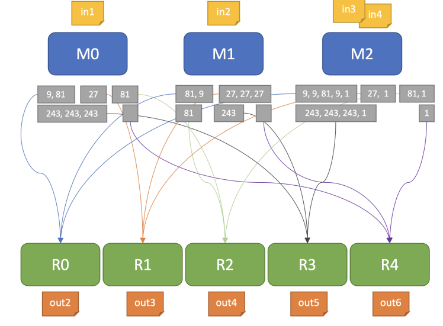

# Map-Reduce parallel processing

## Description
Implementation of a parallel program in Pthreads for finding numbers greater than 0 that are perfect powers from a set of files and counting unique values ​​for each exponent. To parallelize the processing of input documents, the Map-Reduce model will be used. Fis, yesterday of input will be distributed (dynamically) as evenly as possible to the threads that will parse and verify them which numbers greater than 0 are perfect powers (Map operation), thus resulting in partial lists for each exponent (eg, lists for perfect squares, lists for perfect cubes, etc.). The next step represents the combination of partial lists (Reduce operation) which will result in aggregated lists for each exponent separately. For each such list, the unique values ​​will be counted in parallel, the results being then written in output files.

## Map-Reduce paradigm
Map-Reduce is a model (and associated implementation) of parallel programming for processing some huge data sets, using hundreds or thousands of processors. In most cases, Map-Reduce is used in a distributed context, being, in fact, a programming model that can be adapted for both situations. The best known implementation is Apache Hadoop, originally developed by Doug Cutting and Mike Cafarella. The model allows the parallelization and automatic distribution of tasks. The Map-Reduce paradigm it is based on the existing second function, which I also give its name: Map and Reduce. Function, take Map primes, te as input o function f and a list of elements, and returns a new list of elements resulting from the application of function ***f*** on each element in the initial list. The Reduce function combines the previously obtained results.

The Map-Reduce mechanism works as follows:
* the user requests the processing of a set of documents
* this request is addressed to a coordinating process (or execution thread).
* the coordinator assigns documents to processes (or execution threads) of type Mapper1
* a Mapper will analyze the files it is responsible for and generate partial results, having generally the form of {key, value} pairs
* after the Map operations have been executed, other processes (or threads of execution) of type Reducer combine partial results and generate the final solution.

## Map type operations
Starting from the list of documents to be processed that will be available in the input file, each Mapper will
get to process his documents. Allocation of documents to Mapper threads are done statically.

Every Mapper will perform the following actions for ***each file it is responsible for***:
* open the file and go through it line by line (on each line there is an integer value)
* for each integer read, check if it is a perfect power of 2, 3, 4, etc. greater than 0
(the maximum exponent up to which it checks is given by the number of Reducer threads)
* every value greater than 0 that is a perfect power with an exponent __E__ is saved in a partial list (if a value is a perfect power for more exponents  __E__ - for example, 81 can be
written as 3<sup>4</sup>or 9<sup>2</sup> - this will be placed in several partial lists)
* when a file is finished being processed, the Mapper closes it

## Reduce operations

A Reducer thread of execution will be responsible for aggregating and counting perfect power values for a single exponent (for example, one Reducer will deal with perfect squares, another with cubes perfect, etc.). Thus, having the results from the Map operation, a Reducer will perform the following actions:
* combines the partial lists for the exponent E for which he is responsible in an aggregate list (stage of
combination)
* count the unique values ​​from the aggregated list and write the result to a file (processing stage).

## Execution

The program will run as follows:
```
./tema1 <num_mappers> <num_reduces> <input_file>
```
The input file has the following format:
```
file_number_to_process
file1
...
fileN
```
Therefore, the first account line contains the number of text documents to be processed, and the following account lines, in the name
documents, one per line. All input files will contain only ASCII characters and can be considered valid.

A file to be processed has the following format:
```
number_of_values_to_check
value1
...
valueN
```
## Example
```
$ cat test.txt 
4 
in1.txt 
in2.txt 
in3.txt 
in4.txt
```

```
$ cat in1.txt 
6 
243 
9 
27 
243 
81 
243 
$ cat in2.txt 
6 
81
9 
27 
243 
27 
27 
$ cat in3.txt 
6 
9 
27 
9 
81 
9 
53 
$ cat in4.txt 
5 
243 
243 
243 
1 
0
$ ./tema1 3 5 test.txt
```
```
M0 → in1.txt 
M1 → in2.txt 
M2 → in3.txt, in4.txt
```
```
M0 → {9, 81}, {27}, {81}, {243, 243, 243}, {}
M1 → {81, 9}, {27, 27, 27}, {81}, {243}, {}
M2 → {9, 9, 81, 9, 1}, {27, 1}, {81, 1}, {243, 243, 243, 1}, {1}
```
```
R0 → {9, 81, 81, 9, 9, 9, 81, 9, 1} 
R1 → {27, 27, 27, 27, 27, 1}
R2 → {81, 81, 81, 1}
R3 → {243, 243, 243, 243, 243, 243, 243, 1}
R4 → {1}
```
```
$ cat out2.txt 
3 
$ cat out3.txt 
2 
$ cat out4.txt 
2 
$ cat out5.txt 
2 
$ cat out6.txt 
1
```



## Implementation details
### **Main**
In main the Parameter structure is initialized that contains all the data
necessary for the operation of mappers and reducers.
Each thread has an is_mapper field that differentiates mappers from reductions.
Created threads and initialized the starting structure with the necessary 
values(all thread structures will point to the same mutex, 
barrier, input file, mapper and reducer list).
The next cycle joined all the threads.
In the end destroyed mutex, barrier and closed input file.

### **void \*f function**
The thread function separates the work of mappers and reducers using a barrier.
It also uses a mutex prevent the mappers reading at the same time from the input file.
Used a do_your_work variable to distribute dynamically the in files if there are any free mappers

### **void mapper_duty function**
Read the input from the given file and search whether the input number is a perfect power

### **void search_perfect_powers function**
Search for numbers that, raised to all possible powers, will result the given number.
For every power use binary search to find if there is a base.
If found a base for the power, add the number is mapper list to the respective sublist.

### **void reducer_duty function**
Cycle through the mapper list and add all the numbers (from the respective 
power list) to a set(it will automatically retain only unique numbers).
The create the out file and write the size of the set(the number of 
elements in the set).

## Copyright
The test files and program requirements were created by the APD UBP team, Faculty of Automatic and Computers. Implementation and source files belongs to [KenjyHD](https://github.com/KenjyHD)
